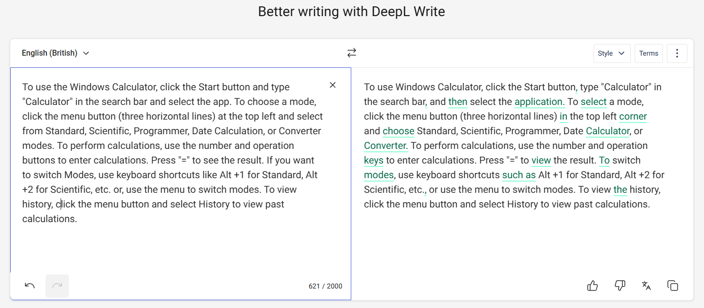
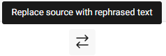

# DeepL

If you need a straightforward AI-powered translator and writing assistant, DeepL is worth considering. DeepL uses Neural Machine Translation (NMT) technology to deliver high-quality translations that capture the nuances and context of the original text. It has a built-in writing assistant that analyses entire sentences, makes corrections and offers suggestions to improve clarity, style and accuracy. The paid version is a good choice for professional use as it offers advanced data security and removes the character limit. You can access the assistant via the website, a downloadable desktop or mobile app, and a browser extension.

For the purpose of this project, we will focus solely on the DeepL writing assistant.

## How to Check Your Text Using DeepL

1. Go to the [**DeepL Write**](https://www.deepl.com/en/write) assistant website.
2. You can select the source language from the language selection list, although DeepL will automatically recognise the language if it is supported.
   
   [, English (British) (selected), French, German, Italian, Portuguese, Portuguese (Brazilian), and Spanish.")](../images/deepllang.png)

   You can click the **Style** button to apply a different writing style or tone.

   [ and a tone (Enthusiastic, Friendly, Confident, Diplomatic), plus buttons for Reset and a disabled Apply button.")](../images/deeplstyle.png)

3. Type or paste your text into the editor.

   

4. Review the corrections and suggestions displayed on the right. If you wish to accept a correction or suggestion, either edit your text manually or click the **Arrows** to apply all changes at once.

   

For more information about DeepL’s features, visit: [Features](https://support.deepl.com/hc/en-us/categories/360002992680-Features).
