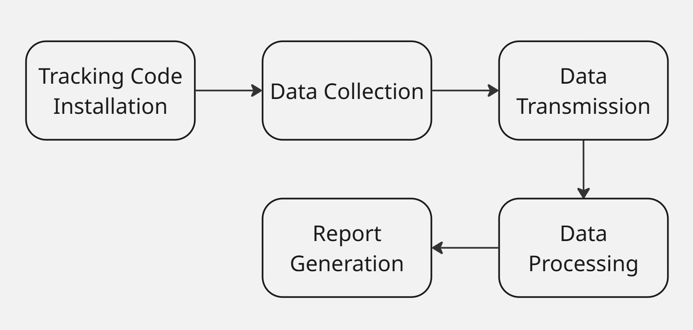
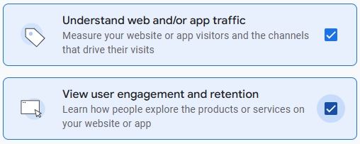
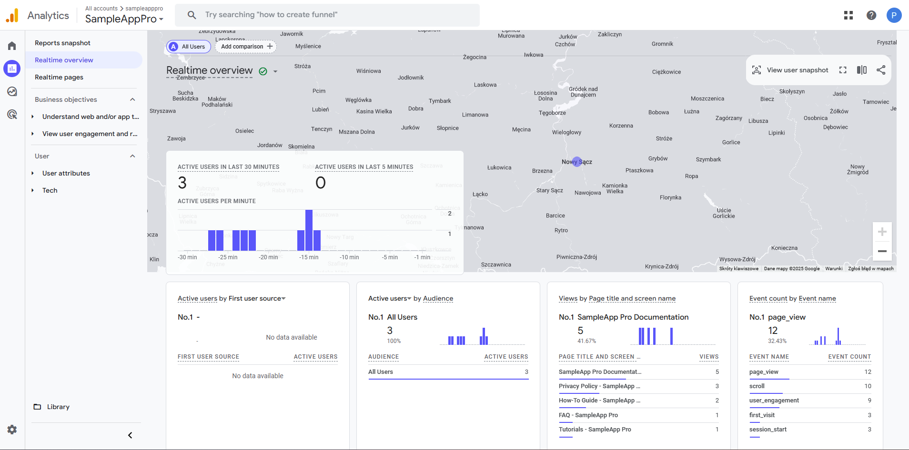
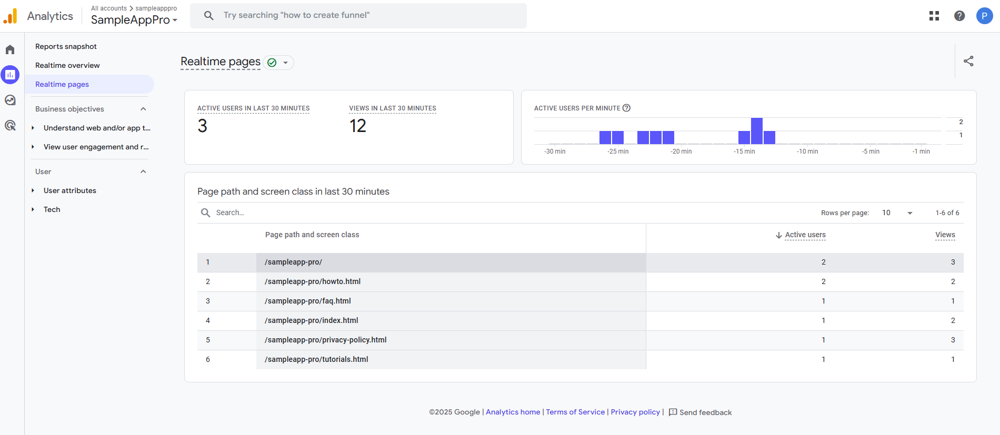

# Google Analytics

When web analytics and tracking are mentioned, the first thing that probably comes to mind is Google Analytics. This service, created and offered by the California-based giant, is the most popular web analytics tool on the internet. Google Analytics is used by the vast majority of websites that employ web analytics tools, with estimates indicating a market share of over 88%. Looking at all websites worldwide, Google Analytics is used by more than half, with the latest figures suggesting that it is implemented on around 55% of all websites.

Among the sites using Google Analytics are major players such as:

* Youtube
* Netflix
* Spotify
* X
* BBC

## How Google Analytics Works

[](../images/gaprocess.jpg)

### Tracking Code Installation

After you create a Google Analytics account, you will get a small JavaScript tracking code. You must add this code to ```<head>``` section of each page.

### Data Collection

Google Analytics measurements are based on cookies. 

Web cookies are small text files created by a server and stored in a user's web browser. They contain information related to the user. Cookies are used to remember user sessions (such as login status), personalize the user experience (for example, by saving language preferences), and track user activities on websites.

There are four types of cookies:

| **Cookie Name** | **Type** | **Description**
|-----------------|-----------------| ------------------------- |
| ```_gat``` | Session cookies| Temporary cookies that work while the browser is open and are deleted after you close it. They track single sessions.|
| ```_ga```, ```_gid```|Persistent cookies|Permanent cookies stored on the user's device. They can track multiple sessions over time.|
| ```_ga```,```_gat```,```_gid```| First-party cookies|Cookies set by the website you are currently visiting.|
| Advertising and Marketing cookies| Third-party cookies| Cookies set by external websites other than the one you are currently visiting, often used for advertising and marketing purposes.|

When someone visits your site for the first time, Google Analytics tracking code detects the visit and places a cookie in the visitor's browser. For example:

``` _ga=GA1.2.123456789.1672531200 ```

* **GA.1.2** - Indicates the version of the Google Analytics cookie format. It remains the same for all users. 
* **123456789** - A randomly generated number that identifies a user.
* **1672531200** - The timestamp representing the user's first visit to the website.

The random number (123456789) and the timestamp (1672531200) together form the Google Analytics client ID. Google Analytics uses the client ID to recognise returning users. If a user clears their cookies or switches to a different browser, they'll be recognized as a new visitor.

> 💡 Google Analytics also collects information from other sources, such as browser details and HTTP requests sent by the browser.

Once the cookie is set, Google Analytics begins collecting data.

### Data Transmission and Processing

Collected data is transmitted to Google Analytics servers, where it is processed into structured metrics and dimensions. You can configure filters to customise how data is processed.

### Report Generation

After Google Analytics has processed the collected data, it is stored in a database. The data cannot be changed at this stage. You can then generate reports using the Google Analytics dashboard.

## How to Start Tracking User Engagement Using Google Analytics

1. Go to the [**Google Analytics**](https://analytics.google.com/) website and log in or create a Google Account. 
2. Click the **Start measuring** button to create a Google Analytics account. 
  
      [](../images/googlestart.png)

3. Create a property. A property represents a website or an app you wish to track.
4. Enter your business details, such as industry category and business size.
5. Select your business objectives from the options provided. For technical documentation purposes, the most relevant options are: 

      [](../images/googleobj.png)

6. Read and accept the Privacy Terms.
7. Choose the data source from which you will be collecting data (you can skip this selection at this stage). This step is necessary to begin tracking. 
8. Configure a data stream (you must set up at least one data stream to start collecting data: web data stream, iOS app data stream or Android app data stream).
9. Set up a Google tag by adding the provided code snippet to every page of your website:

      ```javascript
       <script async src="https://www.googletagmanager.com/gtag/js?id=G-XXXXXXXXXX"></script>
       <script>
       window.dataLayer = window.dataLayer || [];
       function gtag(){ dataLayer.push(arguments); }
       gtag('js', new Date());
       gtag('config', 'G-XXXXXXXXXX');
       </script>
      ```

10. Test the installation. 

You can now begin gathering information about your website traffic.

## Google Analytics Reports

Google Analytics presents traffic reports in the form of configurable dashboards. By default, reports are organised into categories and collections, providing insights into various aspects of user behaviour and website performance. These reports include:

* **Reports Snapshot** - Offers a high-level summary of key metrics, giving you a quick overview of your website’s performance. 

[, new users (3), engagement time (49s), event count (115). Sidebar highlights Realtime overview and Realtime pages under Reports.")](../images/googlereport.png)

* **Realtime Overview** - Displays live data about your website activity, including the number of active users, their geographic locations, and the pages they are currently viewing. This report shows events and usage data from the present moment up to the last 30 minutes.

[](../images/googlerealtimeover.png)

* **Realtime Pages** - Provides detailed, real-time insights into individual pages being viewed by users. It includes metrics such as the active user count and page views over the last 30 minutes, with visualisations like bar graphs and tables to highlight trends in user activity. This feature is particularly useful for monitoring popular content or troubleshooting issues as they arise.

[](../images/googlerealtimepages.png)

For a detailed guide on using and configuring reports in Google Analytics, refer to the official GA4 documentation or the Reports section within your Google Analytics account.

## Privacy Controversies

The use of Google Analytics has long been surrounded by controversy, particularly regarding data privacy and compliance with international regulations. The main issue is the transfer of personal data to servers in the United States, where it may be accessible to US intelligence agencies under American surveillance laws. This practice has raised significant concerns among European Data Protection Authorities (DPAs), especially in relation to the General Data Protection Regulation (GDPR). Several European countries, such as Austria, France and Italy, have ruled that Google Analytics violates the GDPR due to insufficient protections for EU citizens’ data when transferred to the United States.

In July 2023, the EU-US Data Privacy Framework (DPF) was introduced to address the legal uncertainties surrounding transatlantic data transfers. However, it is still unclear whether Google Analytics is fully GDPR-compliant, even though it has implemented improved privacy features such as IP anonymisation, granular consent options, and data retention controls.

Companies interested in implementing Google Analytics must consider several measures to achieve GDPR compliance. We will discuss this in more detail in the section on GDPR.
