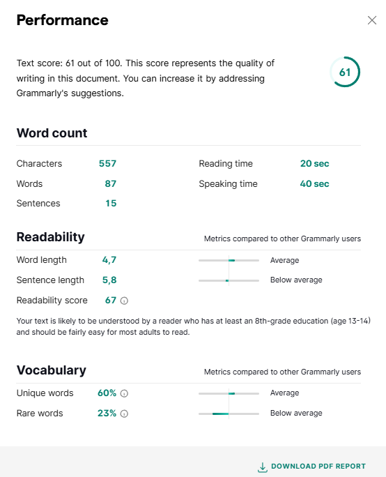

# Grammarly

Grammarly is one of the most popular artificial intelligence-based writing assistants, designed to improve the quality and consistency of writing. It is available as a browser extension, desktop application, or mobile app.

Main features in the free version include:

*  Checking grammar and spelling.
*  Correcting punctuation errors. 
*  Suggesting basic improvements to style and clarity.
*  Providing real-time feedback with underlines in different colours to indicate types of suggestions: 
   *  Red: corrections
   *  Blue: clarity
   *  Green: delivery
   *  Purple: engagement

Advanced features in the paid version include: 

*  Analysing and adjusting tone to suit the intended audience.
*  Scanning text and detecting plagiarism. 
*  Rewriting entire paragraphs to improve clarity and effectiveness.
*  Generating text based on user prompts.
*  Integrating with popular applications such as Microsoft Word and Google Docs.
*  Supporting collaborative teams with custom style guides, tone settings, and performance tracking.

## How To Analyse Your Text Using Grammarly

1. Go to the [**Grammarly**](https://app.grammarly.com/) website.
2. Click the **Sign up** button to create a free account. 
 
   

3. After logging in, click **New** to open a new document.
   
   

4. Type or paste the text you wish to check.
   
   

5. Click the **Overall score** button at the top centre are of the screen to view your text’s quality score.
   
   

   

6. If your text requires improvements, close the report and review the suggestions in the right-hand panel. Suggestions cover four areas: correctness, clarity, engagement, and delivery.
7. Click **Accept** under each suggestion to apply it to your text.
8. Check the **Overall score** again to see your progress.

For more information about Grammarly’s features, visit: [Tips & Tutorials](https://support.grammarly.com/hc/en-us/categories/115000018631-Tips-Tutorials).
