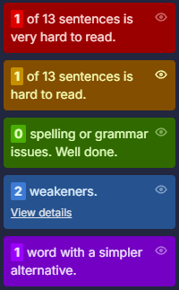

# Hemingway Editor

Another tool you can use to improve the readability of your documentation is the Hemingway Editor, named after Ernest Hemingway, who advocated short sentences and direct writing. The tool focuses on improving style and clarity, and is available as a website or a desktop application.

The free version offers several useful features:

* Readability analysis based on a grade level, helping you understand how easy your content is to read.
* Colour-coded highlights that indicate the areas for improvement:
   * Blue: adverbs and weak words.
   * Green: grammar and spelling (premium).
   * Purple: complex words or phrases that can be simplified.
   * Yellow: sentences that are hard to read.
   * Red: sentences that are very hard to read.
* Suggestions for simpler word choices when complex words are used. 

You can upgrade the free version to the paid Hemingway Editor Plus. It offers additional features such as:

* Sentence rewriting with the use of AI.
* Advanced grammar checking.
* Synonym suggestions to enrich your writing. 
* Tone and style adjustments to suit different audiences.

## How To Analyse Your Text Using the Hemingway Editor

1. Go to the [**Hemingway Editor**](https://hemingwayapp.com/) website.
2. On your first visit, you will see a sample welcome text demonstrating the main features in action. You can remove the example and insert or write your own text.

   

3. When you have finished writing, click on the **Show more stats** button. 
   
   
   
   It will show you the quantitative statistics about your text.

   

4. Below the statistics, you will find colour-coded highlights corresponding to areas for improvement within your text.
   
   

   Click **View details** in the weakeners section for more information about adverbs, passive voice and qualifiers used in your text.

   

5. Review the suggestions and decide whether to rewrite your text or leave it as it is.

For more information about the Hemingway Editor’s features, visit: [Get Started With Hemingway Editor Plus](https://hemingwayapp.com/help).
