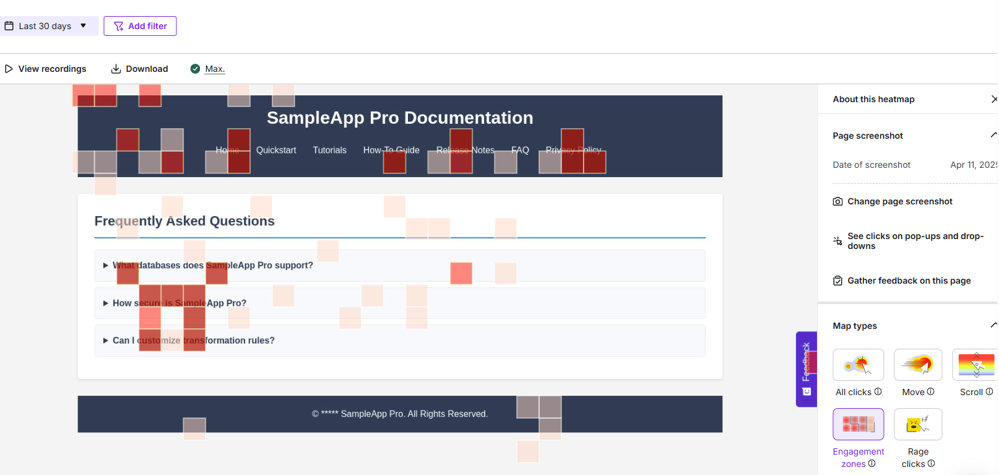

# Hotjar

Google Analytics is primarily a quantitative analytics tool, providing metrics on website traffic and user demographics. If you are seeking qualitative insights to delve deeper into user behaviour, Hotjar can be a well-judged choice. It offers visual tools such as:

* **Heatmaps** – Visual data showing where users click, move, and scroll on a page. This can help you see whether users scroll past key documentation sections or understand where they expect to find help.
* **Session Recordings** – Replays of user sessions that reveal navigation paths and interactions.
* **User Feedback** – Built-in tools to collect comments from users, enabling you to gain direct insights into the clarity of your documentation.
* **Integration** – Works with other tools, such as Google Analytics, allowing you to combine and analyse data more effectively.

## How Hotjar Works

In general, the mechanism behind Hotjar is very similar to that of Google Analytics. Tracking and data collection begin after you embed a unique tracking code snippet into your website.

The tracking code sets first-party cookies in the visitor’s browser, which store session and user-specific data, such as user IDs and session details. The data collected is then transmitted to Hotjar’s servers (Hotjar anonymises all sensitive data by default). The data is processed to create playback recordings or visual insights, such as heatmaps.

Examples of Hotjar cookies types:

| **Cookie Name** | **Type** | **Description**|                                                              
|--------------|-------------|-------------|
| `_hjSessionUser_{site_id}` | Persistent, First-Party | Stores the unique Hotjar User ID for behaviour attribution across sessions.|
| `_hjSession_{site_id}` | Session, First-Party | Holds current session data for attributing requests within the session window.|
| `_hjFirstSeen` | Session, First-Party | Identifies the first session of a new user.|
| `_hjAbsoluteSessionInProgress` | Session, First-Party |Detects the first pageview session of a user.|
| `_hjid` | Persistent, First-Party | Stores the unique Hotjar User ID to attribute behaviour across visits.|
| `_hjRecordingEnabled` | Session, First-Party | Tracks whether a user is part of a recording session.|
| `_hjRecordingLastActivity`| Session, First-Party | Updates during user recording and action data transmission.|

## How to Start Tracking User Engagement Using Hotjar

1. Go to the [**Hotjar**](https://www.hotjar.com/) website and click the **Get started** button.

    [](../images/hotjarstart.png)

    You can sign up with Google or your email address.
2. Enter details about your organisation and your role.
3. Answer or skip the personalisation questions.
4. Enter the URL of your documentation site (you can skip this step and configure it later).

      [](../images/hotjarsite.png)

  > 💡 The initial configuration allows you to add an NPS survey and a feedback button.

5. On the welcome page you will find the JavaScript code snippet. Copy and paste it into the ```<head>``` section of every page you wish to track.
    ```JavaScript
    <script>
    (function(h,o,t,j,a,r){
    h.hj=h.hj||function(){(h.hj.q=h.hj.q||[]).push(arguments)};
    h._hjSettings={hjid:YOUR_HJID, hjsv:YOUR_HJSV};
    a=o.getElementsByTagName('head')[0];
    r=o.createElement('script');r.async=1;
    r.src=t+h._hjSettings.hjid+j+h._hjSettings.hjsv;
    a.appendChild(r);
    })(window,document,'//static.hotjar.com/c/hotjar-','.js?sv=');
    </script>
    ```
6. Click **Verify installation** to check if the code has been installed correctly.

      [](../images/hotjarverify.png)

You can now gather information about users' behaviour on your website.

## Hotjar Reports

Hotjar’s default dashboard provides a centralised view of user behaviour. It displays essential metrics such as total sessions, average session duration, bounce rate, top pages, and rage clicks (a series of rapid, multiple clicks that may indicate user frustration). Hotjar’s dashboard is designed as a set of widgets presenting data in charts and graphs. You can easily access heatmaps and recordings of user sessions. The dashboard is customisable, allowing you to reorder and save widget preferences.

### Visual Reports

One of Hotjar’s most valuable features is session recordings, which offer significant advantages for analysing and enhancing information architecture and user experience:

<video width="640" height="360" controls>
  <source src="../video/hotjar1.mp4" type="video/mp4">
</video>

Heatmaps also provide valuable insights. They highlight interactive areas and potential issues with non-interactive elements, track mouse movements to reveal areas of interest or hesitation, and show how far users scroll down a page, which can help prioritise content placement:

[](../images/hotjarengage.png)

### User Feedback

Hotjar’s user feedback feature allows you to gather opinions directly from your users. Customisable widgets, which you can place on specific pages, enable visitors to rate them, leave comments, or attach screenshots. This feedback is collected in real time and can be a useful resource for usability improvements.

<video width="640" height="360" controls>
  <source src="../video/feedback.mp4" type="video/mp4">
</video>

Comments will appear in the dashboard under the survey section.

[](../images/hotjarfeedback2.png)

## Privacy

Hotjar has implemented extensive measures to comply with GDPR, including:

* **Privacy by Design** - Privacy features such as IP anonymisation and suppression of sensitive data input records are built into the platform’s design.
* **Cross-Border Data Transfer** - Hotjar ensures secure processing and storage of personal data within an EU-based Amazon Web Services infrastructure located in Ireland.
* **Compliance Support for Customers** - Hotjar provides tools and documentation to help customers use its tracking services in a GDPR-compliant manner, including: [Compliance FAQs](https://help.hotjar.com/hc/en-us/articles/360046544833-Compliance-FAQs).
* **Adherence to Data Subjects' Rights** - Such as the right to access (users can request access to their personal data) and the right to erasure (personal data will be deleted upon request).

Thanks to its privacy-centric approach, Hotjar is a tool that can be used in compliance with current data protection regulations. This, of course, requires correct implementation by the user in accordance with regulatory requirements.