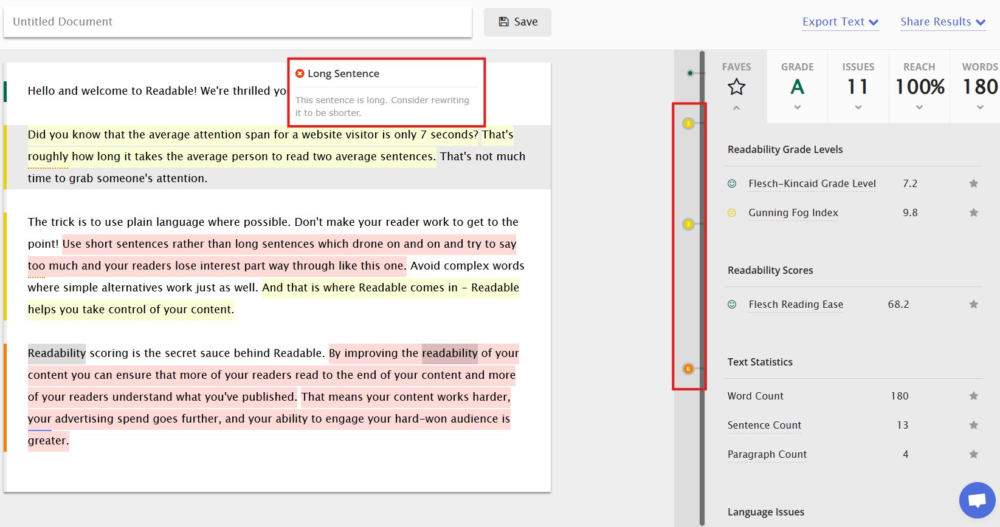
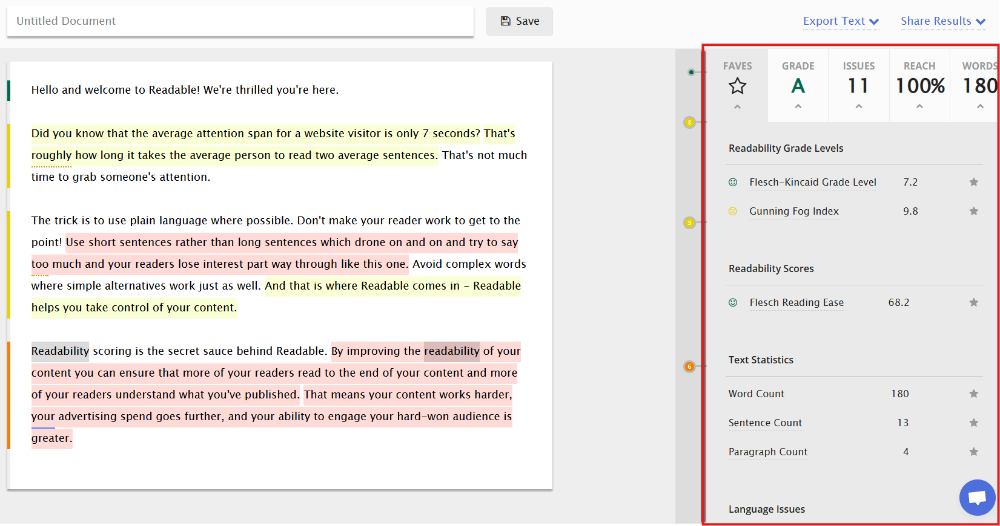

# Readable

Readable is an online tool designed to help you check and improve the quality of your content. It analyses text using a range of metrics to ensure it is understandable to your intended audience:

* Readability scores based on formulas such as the Flesch-Kincaid Readability Score, Gunning Fog Index, SMOG Index and more.
* Tone, sentiment and personalism analysis. 
* Reach metrics, which estimate the percentage of your audience likely to understand your text. 
* Keyword density assessment to help you avoid overusing certain terms.
* Text analysis, including identification of passive voice and complex sentences.

The free version offers limited functionality, allowing you to familiarise yourself with the tool. Upgrading to the Pro version provides access to the full range of features.

## How To Analyse Your Text Using the Hemingway Editor

1. Go to the [**Readable**](https://app.readable.com/account/login/) website.
2. Click on **Sign Up Today** to create an account. 
   
   
   
   This will provide a free 7-day trial of the features.
3. Once logged in, type or paste the text you wish to analyse. The editor highlights problematic sentences. Hover your cursor over a sentence to see suggested improvements. You can also view a summary for each paragraph by hovering over the numbers on the dots.
   
   
   
4. Review the analysis in the **Tabs** on the right. The **Faves** tab shows the default favourite scores. You can mark any score as a favourite by clicking the **Star** next to it.
   
   

   Select the **Grade A** tab to view readability grades and scores.

   Select the **Issues** tab to view problems with language, readability, writing style, and text density.

   Select the **Reach** tab to view the target audience score and analysis of tone, sentiment and personalism.

   Select the **Words** tab to view text statistics, timing, and composition analysis.

  5. You can now rewrite your text according to the suggestions to improve your score.

For more information about Readable’s features, visit: [Readable Features](https://readable.com/features/).